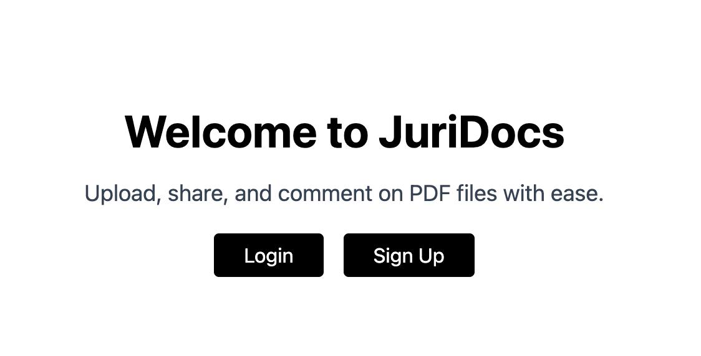
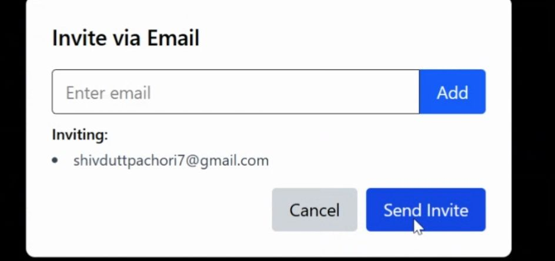

# JuriDocs - PDF Management and Collaboration Platform

**JuriDocs** is a platform that allows users to upload, manage, share, and comment on PDF documents in a secure and collaborative way.

## Video showcasing project features
[Project Demo Link](https://drive.google.com/file/d/158V17YL3wdhFJOmSEyhhNWm1BdhXnnEW/view?pli=1)

## Tech Stack

- **Frontend**: React, Tailwind, redux-tool kit
- **Backend**: Node.js, Express.js
- **Database**: MongoDB
- **Email Sending**: Nodemailer + Gmail SMTP
- **Cloud Storage**: Cloudinary (for PDF uploads and storing)
- **Authentication**: JWT  Tokens
- **WYSIWYG Editor**: Tiny Mce (for adding functioanlity of Bold, Italics, Bullet Point in comments)

##  Setup Instructions

### 1. Clone the repo

```bash
git clone https://github.com/achiveIt/JuriDocs.git
cd juriDocs
```

### 2. Backend Setup

```bash
cd server
npm install
```

Create a `.env` file in `server/` with:

```
PORT = 4000
MONGO_URL = your_mongodb_url

ACCESS_TOKEN_SECRET = your_access_token
ACCESS_TOKEN_EXPIRY = your_access_token
REFRESH_TOKEN_SECRET = your_refresh_token
REFRESH_TOKEN_EXPIRY = your_refresh_token

CLOUDINARY_CLOUD_NAME = your_cloudinary_name
CLOUDINARY_API_KEY = your_cloudinary_api_keys
CLOUDINARY_API_SECRET = your_cloudinary_api_secret

FRONTEND_URL = your_frontend_url

MAIL_USER=your_gmail@gmail.com
MAIL_PASS=your_app_password
```

Start the backend:

```bash
npm run dev
```

### 3. Frontend Setup

```bash
cd client
npm install
npm run dev
```

## 🚀 Features

### User Login and SignUp
- User can create a new account using signUp or login into an existing account.
- The password is hashed (bycryptjs) before saving to db to ensure security.
- User sign up and login functionality with cookie-based sessions.
- Protected routes for authenticated access (dashboard, uploading, etc).



### Password Reset and Account Recovery
- User can reset their password by clicking on changePassword button.
- User can also recover their account in case of forgetting password. They need to enter the email accosiated with JuriDocs and a account recovery mail will be send to them.
- Secure reset link expires after 10 minutes.

### PDF Management
- Upload PDF files via an intuitive interface. (Note: Only PDF format is supported.)
- View all uploaded PDFs in a dashboard with search support.
- Delete PDFs that you no longer need.

### PDF Sharing
- Generate a unique shareable link to give access to others.
- Others can comment and view the shared PDF.
- Shared Links requires the user to create a account.

### Email Invitation
- Invite users via email to access a specific PDF file.
- Invitation emails are sent with a secure access link.
- Invited links do not require authentication to access.
- Only invited email addresses can access the file via link.

Note: User must click on **Add** button to add email in the list of emails who will recieve the share link.


### Commenting System
- Authenticated users can comment on any PDF they own.
- Invited users (via share link over email) can view and comment on PDFs without signing up.
- Support for replying to comments and nested comment threads.
- PDF owners can delete any comment others can delete their own.

### Navigation
- Global navigation includes:
  - Back to Home button from PDF viewer.
  - Logout button in dashboard.
  - Navigation to signup/login from home page.


### Name: Shivdutt Pachori
### Email: shivduttchori7@gmail.com
